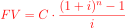
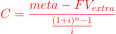

# 📈 Calculadora de Ahorro Programado

Proyecto académico desarrollado bajo principios de **código limpio**, validaciones robustas, excepciones personalizadas y pruebas unitarias.

Esta aplicación calcula cuánto se debe ahorrar mensualmente para alcanzar una meta financiera en un plazo determinado, considerando una tasa de interés mensual fija y un posible abono extra en un mes específico.

---

## 🎯 Objetivo

Calcular la **cuota mensual de ahorro necesaria** para alcanzar una meta financiera utilizando el modelo de **valor futuro de una anualidad con interés compuesto**, incluyendo la posibilidad de un aporte extraordinario.

---

## 🧮 Fundamento Matemático

La aplicación utiliza:

- 📌 **Tasa de interés mensual fija:** `0.75%` (0.0075)
- 📌 Fórmula de valor futuro de anualidad ordinaria:

\[

\]

Donde:

- `C` = cuota mensual  
- `i` = tasa de interés mensual  
- `n` = número de meses  

Si existe un abono extra, se calcula su valor futuro:

\[

\]

Donde:

- `Extra` = monto adicional  
- `k` = mes en el que se realiza el abono  

Finalmente, se despeja la cuota mensual:

\[

\]

El resultado se redondea a **2 decimales**.

---

## 📥 Entradas del Sistema

El programa solicita los siguientes datos por consola:

| Entrada | Tipo | Descripción |
|----------|--------|--------------|
| `meta` | float | Monto total que se desea alcanzar. |
| `plazo` | int | Número de meses para alcanzar la meta. |
| `extra` | float | Abono adicional realizado en un mes específico (puede ser 0). |
| `mes_extra` | int | Mes en el que se realiza el abono extra. |

---

## 🔎 Validaciones Implementadas

El sistema valida que:

- La meta sea mayor que 0.
- El plazo sea mayor que 0.
- El abono extra no sea negativo.
- El abono extra no supere la meta.
- El mes del abono esté dentro del rango del plazo.

Si alguna condición falla, el sistema lanza **excepciones personalizadas**.

---

## ⚙️ Proceso de Ejecución

1. El usuario ingresa los datos solicitados.
2. Se ejecutan las validaciones.
3. Se calcula el valor futuro del abono extra (si existe).
4. Se calcula el factor de anualidad.
5. Se despeja la cuota mensual.
6. Se muestra el resultado o el mensaje de error correspondiente.

---

## 📤 Salida del Sistema

### ✅ Caso Exitoso

Cuando los datos son válidos, el sistema muestra:

```
📈 CALCULADORA DE AHORRO PROGRAMADO

Ingrese la meta de ahorro: 1100000
Ingrese el plazo en meses: 6
Ingrese el monto extra (0 si no aplica): 0

✅ RESULTADO
Debes ahorrar mensualmente: $179925.80
```

El valor:

- Está expresado en moneda.
- Está redondeado a 2 decimales.
- Representa la cuota mensual necesaria para cumplir la meta.

---

### 🚨 Casos de Error

Si ocurre una validación incorrecta, el sistema muestra mensajes descriptivos como:

**Meta inválida**
```
🚨 Error: la meta de ahorro 0 ingresada debe ser mayor a 0
```

**Plazo inválido**
```
🚨 Error: el plazo 0 ingresado debe ser mayor a 0
```

**Abono extra supera la meta**
```
🚨 Error: El extra 800000 ingresado supera la meta de ahorro 400000
```

**Mes fuera de rango**
```
🚨 Error: el mes extra ingresado 5 debe estar entre 1 y el plazo 3
```

**Abono negativo**
```
🚨 Error: abono -200000 ingresado debe ser mayor que 0
```

---

## 🧪 Pruebas Unitarias

El proyecto incluye pruebas automatizadas con `unittest` que cubren:

- Casos normales
- Casos extraordinarios
- Casos límite
- Manejo de errores

Para ejecutar las pruebas:

```bash
python -m unittest
```


## 🧼 Principios Aplicados

- Programación orientada a objetos
- Excepciones personalizadas
- Separación de responsabilidades
- Validaciones robustas
- Código limpio y legible
- Pruebas unitarias automatizadas

---

## 👨‍💻 Autores

Proyecto académico desarrollado por Luisa Fernanda Espinal Montoya y Jose Manuel Jaramillo Valencia como práctica de modelado financiero sobre el ahorro programado y buenas prácticas de programación en Python.
