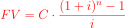
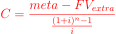

# 📈 Calculadora de Ahorro Programado

Aplicación desarrollada en **Python** que permite calcular cuánto se debe ahorrar mensualmente para alcanzar una meta financiera en un plazo determinado, considerando **interés compuesto mensual** y la posibilidad de realizar un **abono extraordinario**.

El proyecto fue desarrollado aplicando principios de **código limpio, validaciones robustas, manejo de excepciones personalizadas y pruebas unitarias**.

---

# 🎯 Objetivo del Proyecto

Calcular la **cuota mensual de ahorro necesaria** para alcanzar una meta financiera utilizando el modelo de **valor futuro de una anualidad con interés compuesto**, permitiendo incluir un **aporte extraordinario en un mes específico**.

---

# 🧮 Fundamento Matemático

La aplicación utiliza los siguientes parámetros financieros:

- 📌 **Tasa de interés mensual fija:** `0.75%` (`0.0075`)
- 📌 **Modelo financiero:** Valor futuro de una anualidad ordinaria.

### Fórmula del Valor Futuro de la Anualidad



Donde:

- `cuota_mensual` = monto que se ahorra cada mes  
- `tasa` = tasa de interés mensual  
- `plazo` = número total de meses

---

### Valor Futuro del Abono Extra


Donde:

- `extra` = monto adicional
- `mes_extra` = mes en el que se realiza el abono

---

### Cálculo de la Cuota Mensual



El resultado final se **redondea a 2 decimales**.

---

# 🏗️ Arquitectura del Proyecto

El sistema sigue el principio de **separación de responsabilidades**, dividiendo el proyecto en tres capas principales:

- **Core (lógica de negocio)**
- **UI (interfaz de usuario)**
- **Tests (pruebas unitarias)**

```
CALCULADORA_AHORRO_PROGRAMADO
│
├── assets/
│   └── images/
│       ├── formula2.svg
│       ├── fvextra.svg
│       └── cuotamensual.svg
│
├── src/
│   ├── core/
│   │   └── ahorro.py
│   │
│   └── ui/
│       └── console.py
│
├── tests/
│   └── test_ahorroprogramado.py
│
└── README.md
```

---

## 📦 src/core

Contiene la **lógica de negocio del sistema**.

Archivo principal:

```
ahorro.py
```

Responsabilidades:

- Validar los datos ingresados
- Calcular el valor futuro del abono extra
- Calcular el factor de anualidad
- Determinar la cuota mensual necesaria

La lógica fue refactorizada para **mejorar la legibilidad del código**, separando responsabilidades en métodos específicos:

| Método | Responsabilidad |
|------|------|
| `calcular_ahorro()` | Ejecuta el cálculo principal |
| `_validar_datos()` | Realiza las validaciones |
| `_calcular_valor_futuro_extra()` | Calcula el valor futuro del abono extra |
| `_calcular_factor_anualidad()` | Calcula el factor financiero de la anualidad |

---

## 🖥️ src/ui

Contiene la **interfaz de usuario por consola**.

Archivo:

```
console.py
```

Responsabilidades:

- Solicitar datos al usuario
- Mostrar resultados
- Manejar errores mediante excepciones

---

## 🧪 tests

Contiene las **pruebas unitarias automatizadas**.

Archivo principal:

```
test_ahorroprogramado.py
```

Las pruebas cubren:

- Casos normales
- Casos extraordinarios
- Casos límite
- Validaciones
- Manejo de excepciones

---

# 📥 Entradas del Sistema

El programa solicita los siguientes datos por consola:

| Entrada | Tipo | Descripción |
|------|------|------|
| `meta` | float | Monto total que se desea alcanzar |
| `plazo` | int | Número de meses para alcanzar la meta |
| `extra` | float | Abono adicional realizado en un mes específico |
| `mes_extra` | int | Mes en el que se realiza el abono extra |

---

# 🔎 Validaciones Implementadas

El sistema valida que:

- La **meta** sea mayor que 0
- El **plazo** sea mayor que 0
- El **abono extra** no sea negativo
- El **abono extra** no supere la meta
- El **mes del abono extra** esté dentro del rango del plazo

Si alguna condición falla, el sistema lanza **excepciones personalizadas**.

---

# ▶️ Ejecución de la Aplicación

Para ejecutar la calculadora desde la consola, ubícate en la raíz del proyecto y ejecuta:

```bash
python src/ui/console.py
```

El sistema solicitará los datos necesarios.

Ejemplo:

```
📈 CALCULADORA DE AHORRO PROGRAMADO

Ingrese la meta de ahorro: 1100000
Ingrese el plazo en meses: 6
Ingrese el monto extra (0 si no aplica): 0
Ingrese el mes del abono extra: 0
```

Resultado:

```
✅ RESULTADO
Debes ahorrar mensualmente: $179925.80
```

---

# 🧪 Ejecución de Pruebas Unitarias

El proyecto incluye pruebas unitarias utilizando la librería estándar **unittest** de Python.

Para ejecutar todas las pruebas:

```bash
python -m unittest discover -s tests
```

Salida esperada:

```
.....
----------------------------------------------------------------------
Ran 5 tests in 0.002s

OK
```

Esto indica que **todas las pruebas pasaron correctamente**.

---

# 🧼 Buenas Prácticas Aplicadas

Este proyecto implementa:

- ✔️ Programación Orientada a Objetos (POO)
- ✔️ Separación de responsabilidades
- ✔️ Validaciones robustas
- ✔️ Manejo de excepciones personalizadas
- ✔️ Código limpio y legible
- ✔️ Pruebas unitarias automatizadas
- ✔️ Variables descriptivas para mejorar la comprensión del código

---

# 👨‍💻 Autores

Proyecto académico desarrollado por:

**Luisa Fernanda Espinal Montoya**  
**José Manuel Jaramillo Valencia**

Como práctica de **modelado financiero aplicado al ahorro programado y buenas prácticas de programación en Python**.